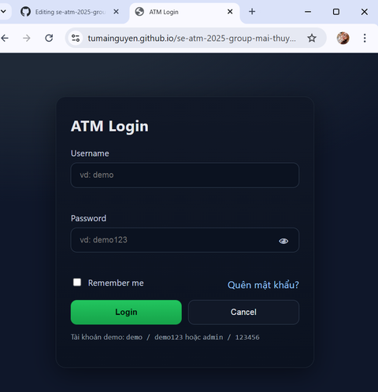

# Lab 04 – Form Login (HTML/CSS/JS)

## Yêu cầu
- Có Username, Password, Remember me, nút **Login** và **Cancel**
- Kiểm tra dữ liệu nhập bằng JavaScript (rỗng, độ dài, pattern)
- Có demo online bằng GitHub Pages

## Kiến trúc
- HTML: `index.html` (Mai)
- CSS: `styles.css` (Thùy)
- JS: `app.js` (Hân)

## Chạy local
- Mở `labs/lab04-login/index.html` trực tiếp (hoặc dùng VS Code + Live Server)

## Tài khoản demo
- `demo / demo123`
- `admin / 123456`
## Demo
- URL: https://tumainguyen.github.io/se-atm-2025-group-mai-thuy-han/lab04/

## Phân công (Teamwork)
- **Nguyễn Đỗ Tú Mai** – Setup HTML, README, bật GitHub Pages, copy demo vào `docs/lab04/`.
- **Trần Nguyễn Phương Thùy** – CSS giao diện + responsive.
- **Nguyễn Thị Ngọc Hân** – JavaScript: validate, remember me, cancel, show/hide password.

## Test cases
1. Trống fields → báo lỗi.
2. Username < 3 hoặc chứa ký tự lạ → báo lỗi.
3. Password < 6 → báo lỗi.
4. Sai tài khoản → báo “Sai username hoặc password”.
5. Đúng `demo/demo123` hoặc `admin/123456` → login thành công.
6. Remember me → reload vẫn giữ username.
7. Nút 👁 show/hide password; **Cancel** reset form.
