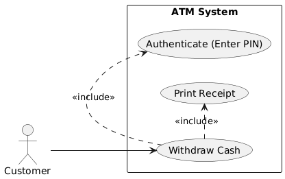
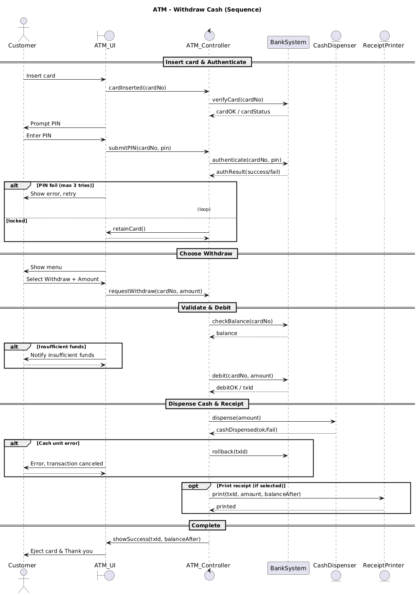

# Lab 05 – Project Report: ATM Mini Project

## 1. Thông tin nhóm
- **Nguyễn Đỗ Tú Mai** – Leader / Dev
- **Trần Nguyễn Phương Thùy** – Dev / Tester
- **Nguyễn Thị Ngọc Hân** – BA / QA

## 2. Tổng quan & Mục tiêu
Dự án áp dụng quy trình phần mềm từ yêu cầu → thiết kế → lập trình → kiểm thử → triển khai demo.

- **Use Case & Sequence**: mô tả quy trình **Withdraw Cash** (Lab 02–03)
- **Form Login**: HTML/CSS/JS (Lab 04), có demo GitHub Pages
- **Phiên bản nộp**: **v1.0**

## 3. Artifacts (tạo từ các lab trước)
- **Use Case (rút gọn Withdraw)**  
  
  ### Use Case: Withdraw Cash
- *Actor*: Customer
- *Include*: Authenticate (Enter PIN), Print Receipt
- *Luồng chính*: chọn rút tiền → nhập số tiền → kiểm tra số dư → nhả tiền → (opt) in biên lai
- **Sequence Diagram (Withdraw)**  
  
  ### Sequence: Withdraw Cash
- *ATM_UI* (boundary): tương tác màn hình/phím
- *ATM_Controller* (control): điều phối, gọi BANK, CASH, PRN
- *BankSystem*: verify card, authenticate, checkBalance, debit, rollback
- *CashDispenser*: dispense
- *ReceiptPrinter*: print
- *Nhánh alt*: PIN sai/khóa thẻ; thiếu tiền; lỗi nhả tiền → rollback
- **Form Login (source)**: `labs/lab04-login/`  
  **Demo**: `docs/lab04/` → mở bằng GitHub Pages

## 4. Quy trình & Công cụ
- **Quy trình**: Agile mini – mỗi Lab là 1 “iteration”, mỗi người 1 nhánh/PR
- **Công cụ**: GitHub (Code/PR/Release), PlantUML, VS Code
- **Quy ước nhánh**: `mai/...`, `thuy/...`, `han/...`  
- **Message PR**: `feat(...)`, `docs(...)`, `chore(...)`

## 5. Hướng dẫn chạy
### 5.1. Chạy demo online
- GitHub Pages: **(điền link sau khi bật)**

### 5.2. Chạy local
- Mở `labs/lab04-login/index.html` trực tiếp (hoặc VS Code + Live Server)

## 6. Kiểm thử cơ bản (Form Login)
| Case | Input | Expect |
|------|-------|--------|
| Empty | username/password rỗng | Hiện lỗi |
| Short | pass < 6 | Hiện lỗi |
| Valid | `demo/demoi23` (vd) | Đăng nhập fail (demo list hợp lệ xem README) |
| Valid demo | `demo/demo123` | Toast “thành công”, reset sau 1.5s |
| Remember me | tick | Tự điền username lần sau |

## 7. Phân công & đóng góp
- Mai: khung HTML, README, Pages, release v1.0
- Thùy: CSS + UML
- Hân: JS + test + hướng dẫn push code

## 8. Ghi chú kỹ thuật
- Validate form: kiểm tra rỗng/độ dài/pattern; localStorage cho Remember me
- Sequence có nhánh **alt/opt** (PIN sai, thiếu tiền, lỗi nhả tiền)

## 9. Link nhanh
- Lab 02: `labs/lab02/`
- Lab 03: `labs/lab03/`
- Lab 04 (source): `labs/lab04-login/`
- Lab 04 (demo): `docs/lab04/` (GitHub Pages)

