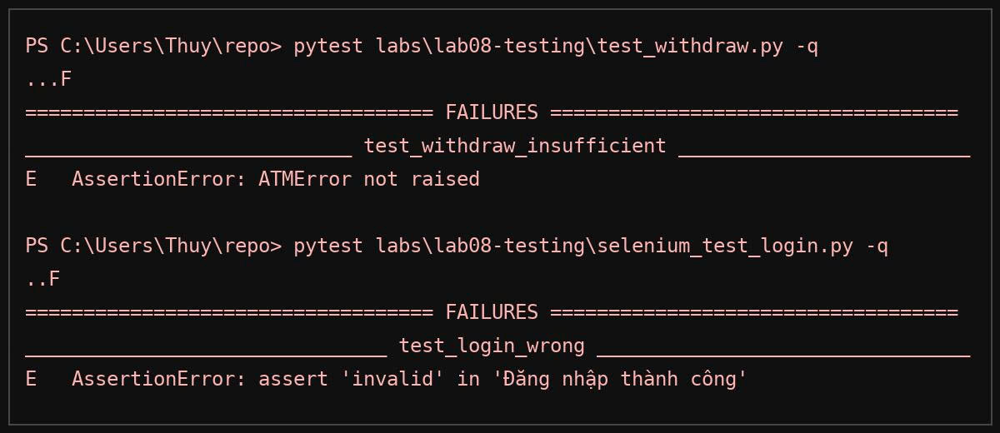

Init Lab 08
# Lab 08 – Kiểm thử ATM (Unit & Integration)

## 1) Chuẩn bị
- MySQL đang chạy (XAMPP → *Start MySQL*), DB atm_demo đã import từ labs/lab07-withdraw-module/sql/schema.sql.
- Python 3.10+
- Cài dependency:
```bash
pip install -r labs/lab08-testing/requirements.txt
2) Chạy Unit Test (ATM)

Kiểm thử 4 case: PIN đúng/sai, rút thành công/không đủ tiền.

pytest labs/lab08-testing/test_withdraw.py -q \
  --html labs/lab08-testing/reports/unit_report.html --self-contained-html
3) Chạy Integration Test (Form Login – Selenium)

Cách A – GitHub Pages: đặt biến môi trường URL của form:

# ví dụ:
set LOGIN_URL=https://<username>.github.io/<repo>/docs/lab04/
pytest labs/lab08-testing/selenium_test_login.py -q \
  --html labs/lab08-testing/reports/selenium_report.html --self-contained-html
Cách B – Local server:

# mở server tại root repo
python -m http.server 8000
# tab/cửa sổ khác:
pytest labs/lab08-testing/selenium_test_login.py -q \
  --html labs/lab08-testing/reports/selenium_report.html --self-contained-html
```


